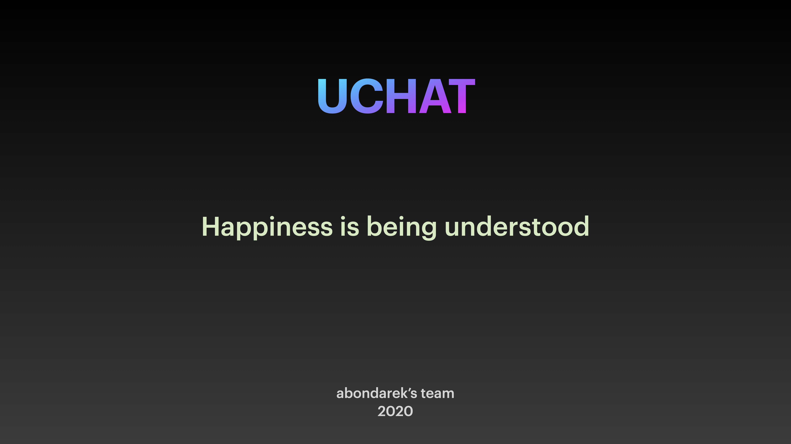

# uChat

## Description

Сreating messaging application for MacOS. Application composed of two parts: client and server.

## Getting Started

These instructions will get you a copy of the project up and running on your local machine for development and testing purposes.
See deployment for notes on how to deploy the project on a live system.

### TODO

1. `make` in project root
2. Run `./uchat_server` in shell
3. Run `./uchat` in shell

## Authors

* **Andrii Bondarenko** - [PraydE](https://github.com/PraydE007)
* **Anatolii Akostanda** - [akostanda](https://github.com/akostanda)
* **Oleksandr Zahirnyi** - [ozahirnyi](https://github.com/ozahirnyi)
* **Yaroslav Pratsovity** - [Eimer](https://github.com/Eimer)

## License

* This project is licensed under the MIT License - see the [LICENSE.md](LICENSE.md) file for details
* Icons made by **Pixel perfect** from [flaticon](www.flaticon.com).

